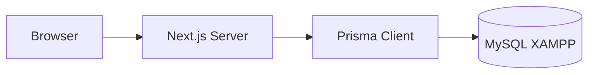

# Arsitektur — P2H Kendaraan

## Ringkasan

Aplikasi **Next.js 16** (App Router, React 19) untuk **Pemeriksaan / Pemeliharaan Harian (P2H)** unit kendaraan. Data persisten di **MySQL** (XAMPP) melalui **Prisma ORM 6**.

## Alur data

## Model domain

- **Vehicle**: master unit (nomor polisi unik, merek, jenis, status aktif).
- **ChecklistItem**: master poin pemeriksaan (kategori + label), diisi awal lewat seed.
- **Inspection**: satu sesi P2H (kendaraan, pemeriksa, waktu, odometer, BBM, status draf/dikirim).
- **InspectionLine**: jawaban per poin (OK / NOT_OK / NA + catatan).
- **User**: akun pengguna aplikasi (username unik, password hash bcrypt, NIK unik, nama lengkap, posisi, opsional `role_id`).
- **Role / Permission**: role punya banyak permission lewat `role_permissions`; user bisa punya subset izin kendaraan langsung lewat `user_permissions` (diatur lewat modal di `/settings/users`).

## File penting

| Area | Lokasi |
|------|--------|
| Skema DB | `prisma/schema.prisma` |
| Migrasi | `prisma/migrations/` |
| Seed checklist | `prisma/seed.ts` |
| Client DB singleton | `src/lib/db.ts` |
| Server actions | `src/app/actions/vehicles.ts`, `src/app/actions/inspections.ts`, `src/app/actions/users.ts` |
| UI shell | `src/components/AppShell.tsx` |
| Pengaturan (users, roles UI) | `src/app/settings/` (`/settings/users`, `/settings/roles`) |
| Login & sesi | `src/app/login/`, `src/middleware.ts`, `src/lib/auth-jwt.ts`, `src/lib/auth-session.ts` |

## Setup lokal (XAMPP)

1. Nyalakan Apache & MySQL di XAMPP.
2. Buat database `p2h`.
3. Set `DATABASE_URL` di `.env` (lihat `.env.example`).
4. `npx prisma migrate deploy` (atau `npm run db:migrate` untuk dev).
5. `npm run db:seed` untuk master checklist.
6. `npm run dev` → `http://localhost:3000`.
